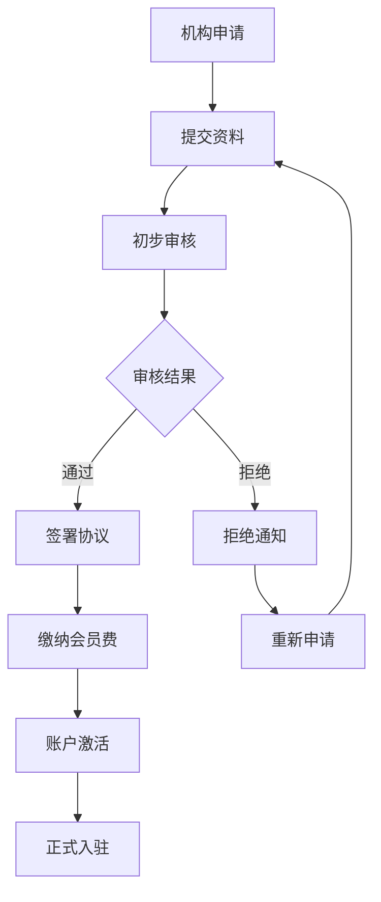
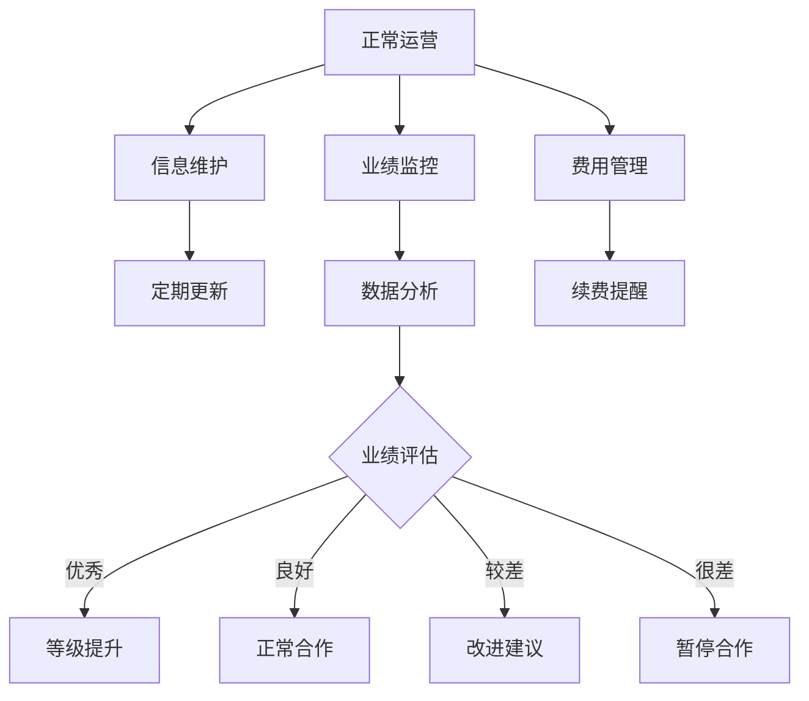
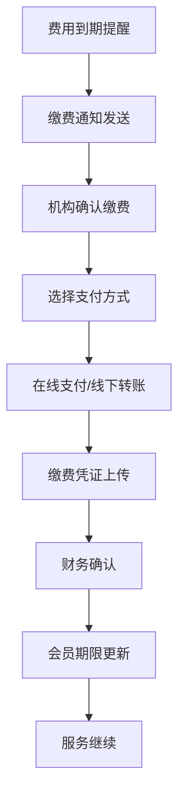

# DRMP机构管理模块详细规划

## 1. 模块概述

机构管理模块是DRMP全国分散诉调平台的核心功能模块之一，负责管理平台内的所有机构（案源机构和处置机构），提供机构的完整生命周期管理，包括入驻申请、审核、信息维护、业绩监控、会员管理等功能。

### 1.1 目标用户
- **平台管理员**：负责机构审核、监管、数据统计
- **机构管理员**：负责本机构信息维护、用户管理
- **机构操作员**：日常业务操作人员

### 1.2 核心价值
- 规范化机构准入流程，确保平台机构质量
- 提供完整的机构信息管理和维护功能
- 实现机构业绩监控和数据分析
- 支持灵活的权限控制和角色管理

## 2. 业务流程设计

### 2.1 机构入驻流程



#### 2.1.1 申请阶段
- **机构类型选择**：案源机构（银行、消金、网贷、小贷、AMC）或处置机构（调解中心、律所、其他）
- **基础信息填写**：机构名称、统一社会信用代码、联系信息、业务范围
- **资质文件上传**：营业执照、相关业务许可证、法人身份证明
- **服务能力说明**：团队规模、月处理能力、服务区域、历史业绩

#### 2.1.2 审核阶段
- **自动校验**：信息完整性、格式规范性检查
- **人工审核**：资质真实性验证、业务能力评估
- **实地考察**（可选）：重要机构现场调研
- **审核决策**：通过、拒绝、补充材料

#### 2.1.3 合作阶段
- **协议签署**：线上签署合作协议
- **费用缴纳**：处置机构缴纳年度会员费
- **系统配置**：权限分配、功能开通
- **培训指导**：平台使用培训、业务流程指导

### 2.2 机构运营流程



## 3. 功能模块设计

### 3.1 机构列表管理

#### 3.1.1 功能描述
提供所有机构的统一查看和管理界面，支持多维度筛选、排序、批量操作。

#### 3.1.2 界面设计
- **统计卡片区域**：总机构数、案源机构数、处置机构数、正常运行数、待审核数、已停用数
- **筛选标签**：全部机构、案源机构、处置机构、正常运行、待审核
- **搜索筛选栏**：关键词搜索、机构类型、状态、服务区域、时间范围
- **操作按钮**：新建机构、刷新、导出、批量操作
- **数据表格**：机构信息、联系信息、处理能力、服务区域、状态、操作

#### 3.1.3 表格字段设计
| 字段 | 说明 | 数据类型 | 显示方式 |
|------|------|----------|----------|
| 机构信息 | 机构头像、名称、代码、类型 | 复合字段 | 头像+文本+标签 |
| 联系信息 | 联系人、电话、邮箱 | 复合字段 | 图标+文本 |
| 处理能力 | 团队规模、月处理能力、当前负载 | 复合字段 | 数值+进度条 |
| 服务区域 | 支持的地理区域 | 数组 | 标签列表+更多 |
| 状态 | 机构当前状态、审核时间 | 枚举+时间 | 彩色标签+日期 |
| 最后活跃 | 最后登录/操作时间 | 时间 | 日期格式 |
| 操作 | 查看、编辑、更多 | 按钮组 | 图标按钮 |

#### 3.1.4 交互设计
- **分页加载**：支持分页大小调整（10/20/50/100）
- **实时筛选**：筛选条件变化时自动刷新数据
- **快速搜索**：搜索框支持防抖，300ms延迟
- **批量选择**：支持全选、反选、跨页选择
- **批量操作**：激活、停用、导出选中、删除（需二次确认）
- **数据导出**：支持Excel格式，包含当前筛选结果

### 3.2 机构详情查看

#### 3.2.1 功能描述
展示机构的完整信息，包括基础信息、资质文件、业绩数据、历史记录等。

#### 3.2.2 页面结构
```
机构详情页
├── 头部信息区
│   ├── 机构基本信息（名称、类型、状态）
│   ├── 快速操作按钮（编辑、审核、停用等）
│   └── 状态流转历史
├── 详细信息标签页
│   ├── 基础信息
│   ├── 资质证明
│   ├── 业务能力
│   ├── 财务信息
│   ├── 合作历史
│   └── 操作日志
└── 相关数据图表
    ├── 业绩趋势图
    ├── 案件处理统计
    └── 回款率分析
```

#### 3.2.3 基础信息展示
- **机构概况**：名称、代码、类型、成立时间、注册资本
- **联系信息**：联系人、电话、邮箱、地址
- **法律信息**：法定代表人、统一社会信用代码、营业期限
- **业务信息**：业务范围、服务区域、资质等级
- **系统信息**：创建时间、最后更新、操作人员

#### 3.2.4 资质证明区域
- **证件展示**：营业执照、业务许可证、资质证书
- **文件管理**：上传、下载、预览、版本管理
- **有效期管理**：到期提醒、续期提醒
- **审核状态**：审核进度、审核意见、审核历史

### 3.3 机构信息编辑

#### 3.3.1 功能描述
提供机构信息的修改和维护功能，支持分步骤填写和实时保存。

#### 3.3.2 表单设计
```
机构信息编辑表单
├── 基础信息步骤
│   ├── 机构基本信息
│   ├── 联系信息
│   └── 法律信息
├── 业务信息步骤
│   ├── 业务范围选择
│   ├── 服务区域设置
│   ├── 处理能力配置
│   └── 收费标准设置
├── 资质上传步骤
│   ├── 必需证件上传
│   ├── 可选证件上传
│   └── 证件有效期设置
└── 确认提交步骤
    ├── 信息预览确认
    ├── 提交审核说明
    └── 提交操作
```

#### 3.3.3 表单验证规则
- **必填字段验证**：确保关键信息完整性
- **格式验证**：手机号、邮箱、统一社会信用代码等格式检查
- **业务规则验证**：服务区域与业务范围的匹配性
- **文件验证**：文件格式、大小、清晰度检查
- **重复性检查**：机构名称、代码的唯一性验证

#### 3.3.4 交互优化
- **自动保存**：每30秒自动保存草稿
- **实时验证**：字段失焦时进行验证提示
- **进度指示**：显示填写进度和完成度
- **帮助提示**：关键字段提供填写说明和示例

### 3.4 机构审核管理

#### 3.4.1 功能描述
为平台管理员提供机构申请和变更的审核功能，支持批量审核和审核流程管理。

#### 3.4.2 审核流程状态
- **待审核**：新提交的申请，等待处理
- **审核中**：正在进行审核，可能需要补充材料
- **已通过**：审核通过，可以正常使用
- **已拒绝**：审核未通过，需要重新申请
- **需补充**：需要提供更多信息或材料

#### 3.4.3 审核操作界面
```
审核详情页
├── 申请信息展示
│   ├── 机构基本信息
│   ├── 申请类型（新入驻/信息变更）
│   ├── 申请时间和申请人
│   └── 变更对比（如果是变更申请）
├── 审核操作区
│   ├── 审核决策选择（通过/拒绝/需补充）
│   ├── 审核意见填写
│   ├── 会员费设置（处置机构）
│   └── 审核提交按钮
├── 历史审核记录
│   ├── 审核时间线
│   ├── 审核人员记录
│   └── 审核意见历史
└── 相关附件
    ├── 申请材料下载
    ├── 补充材料查看
    └── 审核文档生成
```

#### 3.4.4 审核决策支持
- **信息完整性检查**：自动检查必要信息和文件
- **重复性校验**：检查是否与现有机构重复
- **风险评估提示**：基于历史数据的风险指标
- **审核建议**：基于规则引擎的自动建议

### 3.5 机构统计分析

#### 3.5.1 功能描述
提供机构相关的各类统计数据和分析报告，支持多维度数据展示和趋势分析。

#### 3.5.2 统计维度
- **机构数量统计**：按类型、状态、地区分类统计
- **入驻趋势分析**：月度、季度入驻情况趋势
- **业绩统计**：各机构处理案件数量、回款金额
- **活跃度分析**：机构登录频次、操作活跃度
- **服务覆盖**：地理区域覆盖情况分析

#### 3.5.3 数据可视化
```
统计dashboard
├── 核心指标卡片
│   ├── 总机构数
│   ├── 本月新增
│   ├── 活跃机构数
│   └── 服务覆盖率
├── 趋势图表区
│   ├── 入驻趋势折线图
│   ├── 机构类型分布饼图
│   ├── 地区分布地图
│   └── 业绩排行榜
├── 详细数据表
│   ├── 机构业绩排名
│   ├── 新入驻机构列表
│   └── 待处理事项列表
└── 操作功能区
    ├── 时间范围选择
    ├── 数据导出
    └── 报告生成
```

### 3.6 会员费管理

#### 3.6.1 功能描述
管理处置机构的会员费缴纳情况，包括费用设置、缴费提醒、财务对账等功能。

#### 3.6.2 费用管理功能
- **费用标准设置**：不同类型机构的年费标准
- **缴费状态跟踪**：已缴费、待缴费、逾期未缴
- **自动提醒机制**：到期前30天、15天、7天提醒
- **缴费记录管理**：缴费历史、凭证存档
- **财务对账支持**：与财务系统数据对接

#### 3.6.3 缴费流程


## 4. 权限控制设计

### 4.1 角色定义

#### 4.1.1 超级管理员
- **权限范围**：所有机构管理功能
- **主要职责**：系统配置、最终审核决策、数据统计分析
- **操作权限**：创建、查看、编辑、删除、审核、导出

#### 4.1.2 机构管理员
- **权限范围**：机构基础管理功能
- **主要职责**：日常审核、机构信息维护、统计查看
- **操作权限**：查看、编辑、审核（初级）、导出（限制）

#### 4.1.3 机构操作员
- **权限范围**：所属机构信息查看和维护
- **主要职责**：维护本机构信息、查看相关数据
- **操作权限**：查看（本机构）、编辑（本机构基础信息）

### 4.2 权限控制矩阵

| 功能模块 | 超级管理员 | 机构管理员 | 机构操作员 |
|----------|------------|------------|------------|
| 机构列表查看 | 全部 | 全部 | 仅本机构 |
| 机构详情查看 | 全部 | 全部 | 仅本机构 |
| 机构信息编辑 | 全部 | 基础信息 | 仅本机构基础信息 |
| 机构审核 | 全部 | 初审 | 无 |
| 机构删除 | 是 | 否 | 否 |
| 统计数据查看 | 全部 | 汇总数据 | 仅本机构数据 |
| 数据导出 | 全部 | 限制导出 | 仅本机构数据 |
| 会员费管理 | 全部 | 查看 | 查看本机构 |

### 4.3 数据权限控制

#### 4.3.1 行级权限
- **机构维度**：只能操作所属机构的数据
- **地区维度**：只能查看负责地区的机构数据
- **业务维度**：只能操作对应业务类型的机构

#### 4.3.2 字段级权限
- **敏感信息保护**：财务数据、内部评级等敏感字段
- **个人信息保护**：联系人详细信息、身份证号等
- **商业机密保护**：业务数据、合作协议内容等

## 5. 数据模型设计

### 5.1 机构基础信息表 (organizations)

```sql
CREATE TABLE organizations (
    id BIGINT PRIMARY KEY AUTO_INCREMENT,
    org_code VARCHAR(50) UNIQUE NOT NULL COMMENT '机构代码',
    org_name VARCHAR(200) NOT NULL COMMENT '机构名称',
    org_type ENUM('BANK', 'CONSUMER_FINANCE', 'ONLINE_LOAN', 'MICRO_LOAN', 'AMC', 'MEDIATION_CENTER', 'LAW_FIRM', 'OTHER') NOT NULL COMMENT '机构类型',
    status ENUM('PENDING', 'ACTIVE', 'SUSPENDED', 'REJECTED') NOT NULL DEFAULT 'PENDING' COMMENT '机构状态',
    
    -- 联系信息
    contact_person VARCHAR(50) COMMENT '联系人',
    contact_phone VARCHAR(20) COMMENT '联系电话',
    email VARCHAR(100) COMMENT '邮箱地址',
    address VARCHAR(500) COMMENT '机构地址',
    
    -- 法律信息
    legal_representative VARCHAR(50) COMMENT '法定代表人',
    business_license VARCHAR(100) COMMENT '营业执照号',
    registered_capital DECIMAL(15,2) COMMENT '注册资本',
    registration_date DATE COMMENT '注册日期',
    
    -- 业务信息
    team_size INT COMMENT '团队规模',
    monthly_case_capacity INT COMMENT '月处理能力',
    current_load_percentage INT DEFAULT 0 COMMENT '当前负载百分比',
    
    -- 财务信息
    membership_fee DECIMAL(10,2) COMMENT '年度会员费',
    membership_paid BOOLEAN DEFAULT FALSE COMMENT '是否已缴费',
    membership_start_date DATE COMMENT '会员开始日期',
    membership_end_date DATE COMMENT '会员结束日期',
    payment_method VARCHAR(50) COMMENT '支付方式',
    payment_reference VARCHAR(100) COMMENT '支付凭证号',
    payment_date DATE COMMENT '缴费日期',
    
    -- 审核信息
    approval_status ENUM('PENDING', 'APPROVED', 'REJECTED') DEFAULT 'PENDING' COMMENT '审核状态',
    approval_by BIGINT COMMENT '审核人员ID',
    approval_at TIMESTAMP NULL COMMENT '审核时间',
    approval_remark TEXT COMMENT '审核备注',
    
    -- 系统信息
    created_at TIMESTAMP DEFAULT CURRENT_TIMESTAMP,
    updated_at TIMESTAMP DEFAULT CURRENT_TIMESTAMP ON UPDATE CURRENT_TIMESTAMP,
    created_by BIGINT COMMENT '创建人ID',
    updated_by BIGINT COMMENT '更新人ID',
    is_deleted BOOLEAN DEFAULT FALSE COMMENT '是否删除',
    version INT DEFAULT 0 COMMENT '版本号'
);
```

### 5.2 机构服务区域表 (org_service_regions)

```sql
CREATE TABLE org_service_regions (
    id BIGINT PRIMARY KEY AUTO_INCREMENT,
    org_id BIGINT NOT NULL COMMENT '机构ID',
    region VARCHAR(100) NOT NULL COMMENT '服务区域',
    FOREIGN KEY (org_id) REFERENCES organizations(id) ON DELETE CASCADE
);
```

### 5.3 机构业务范围表 (org_business_scopes)

```sql
CREATE TABLE org_business_scopes (
    id BIGINT PRIMARY KEY AUTO_INCREMENT,
    org_id BIGINT NOT NULL COMMENT '机构ID',
    scope VARCHAR(100) NOT NULL COMMENT '业务范围',
    FOREIGN KEY (org_id) REFERENCES organizations(id) ON DELETE CASCADE
);
```

### 5.4 机构审核日志表 (organization_audit_logs)

```sql
CREATE TABLE organization_audit_logs (
    id BIGINT PRIMARY KEY AUTO_INCREMENT,
    org_id BIGINT NOT NULL COMMENT '机构ID',
    operation_type ENUM('CREATE', 'UPDATE', 'APPROVE', 'REJECT', 'SUSPEND', 'ACTIVATE') NOT NULL COMMENT '操作类型',
    old_status VARCHAR(50) COMMENT '原状态',
    new_status VARCHAR(50) COMMENT '新状态',
    operation_by BIGINT NOT NULL COMMENT '操作人员ID',
    operation_time TIMESTAMP DEFAULT CURRENT_TIMESTAMP COMMENT '操作时间',
    remark TEXT COMMENT '操作备注',
    change_details JSON COMMENT '变更详情',
    FOREIGN KEY (org_id) REFERENCES organizations(id) ON DELETE CASCADE
);
```

## 6. API接口设计

### 6.1 机构管理接口

#### 6.1.1 获取机构列表
```
GET /api/organizations
Parameters:
  - page: int (页码，从0开始)
  - size: int (页面大小)
  - sortBy: string (排序字段)
  - sortDir: string (排序方向: asc/desc)
  - keyword: string (搜索关键词)
  - type: string (机构类型)
  - status: string (机构状态)
  - region: string (服务区域)
  - startDate: string (开始日期)
  - endDate: string (结束日期)

Response:
{
    "code": 200,
    "message": "success",
    "data": {
        "content": [...],
        "page": 0,
        "size": 20,
        "totalElements": 100,
        "totalPages": 5,
        "first": true,
        "last": false,
        "hasNext": true,
        "hasPrevious": false
    }
}
```

#### 6.1.2 获取机构详情
```
GET /api/organizations/{id}
Response:
{
    "code": 200,
    "message": "success",
    "data": {
        "id": 1,
        "orgCode": "ORG001",
        "orgName": "测试机构",
        "type": "BANK",
        "status": "ACTIVE",
        ...
    }
}
```

#### 6.1.3 创建机构
```
POST /api/organizations
Request Body:
{
    "orgCode": "ORG001",
    "orgName": "测试机构",
    "type": "BANK",
    "contactPerson": "张三",
    "contactPhone": "13800138000",
    "email": "zhangsan@example.com",
    ...
}

Response:
{
    "code": 200,
    "message": "机构创建成功",
    "data": {...}
}
```

#### 6.1.4 更新机构信息
```
PUT /api/organizations/{id}
Request Body: (同创建机构)
Response: (同创建机构)
```

#### 6.1.5 删除机构
```
DELETE /api/organizations/{id}
Response:
{
    "code": 200,
    "message": "机构删除成功"
}
```

### 6.2 机构审核接口

#### 6.2.1 审核通过
```
POST /api/organizations/{id}/approve
Request Body:
{
    "remark": "审核通过",
    "membershipFee": 50000.00
}
```

#### 6.2.2 审核拒绝
```
POST /api/organizations/{id}/reject
Request Body:
{
    "remark": "资质不符合要求"
}
```

### 6.3 统计数据接口

#### 6.3.1 获取机构统计数据
```
GET /api/organizations/statistics
Response:
{
    "code": 200,
    "message": "success",
    "data": {
        "total": 100,
        "pending": 5,
        "active": 85,
        "suspended": 8,
        "rejected": 2,
        "sourceOrgs": 60,
        "disposalOrgs": 40,
        "thisMonthNew": 12,
        "todayNew": 2
    }
}
```

## 7. 前端组件设计

### 7.1 组件层次结构

```
机构管理模块
├── OrganizationManagement (主容器)
├── OrganizationList (机构列表)
│   ├── OrganizationStatistics (统计卡片)
│   ├── OrganizationFilters (筛选组件)
│   └── OrganizationTable (数据表格)
├── OrganizationDetail (机构详情)
│   ├── OrganizationBasicInfo (基础信息)
│   ├── OrganizationBusinessInfo (业务信息)
│   └── OrganizationHistory (历史记录)
├── OrganizationForm (机构表单)
│   ├── BasicInfoStep (基础信息步骤)
│   ├── BusinessInfoStep (业务信息步骤)
│   └── DocumentStep (文档上传步骤)
├── OrganizationApproval (审核组件)
└── OrganizationStats (统计分析)
```

### 7.2 状态管理设计

#### 7.2.1 使用Zustand进行状态管理
```typescript
interface OrganizationStore {
    // 数据状态
    organizations: Organization[];
    currentOrganization: Organization | null;
    statistics: OrganizationStatistics;
    
    // UI状态
    loading: boolean;
    filters: OrganizationFilters;
    pagination: PaginationState;
    
    // 操作方法
    fetchOrganizations: (params: QueryParams) => Promise<void>;
    fetchOrganizationDetail: (id: number) => Promise<void>;
    updateFilters: (filters: Partial<OrganizationFilters>) => void;
    resetFilters: () => void;
}
```

### 7.3 组件交互设计

#### 7.3.1 表格交互
- **选择交互**：支持单选、多选、全选、反选
- **排序交互**：点击列头进行排序，支持升序降序切换
- **筛选交互**：实时筛选，防抖处理，筛选条件持久化
- **分页交互**：页码跳转、页面大小调整、总数显示

#### 7.3.2 表单交互
- **步骤导航**：支持步骤跳转、进度显示、完成状态指示
- **实时验证**：字段失焦验证、格式检查、业务规则验证
- **自动保存**：定时保存草稿、页面刷新保护、数据恢复
- **文件上传**：拖拽上传、进度显示、格式验证、大小限制

## 8. 异常处理和错误提示

### 8.1 错误分类

#### 8.1.1 客户端错误 (4xx)
- **400 Bad Request**：请求参数错误
- **401 Unauthorized**：未授权访问
- **403 Forbidden**：权限不足
- **404 Not Found**：资源不存在
- **409 Conflict**：数据冲突（如机构代码重复）

#### 8.1.2 服务端错误 (5xx)
- **500 Internal Server Error**：系统内部错误
- **502 Bad Gateway**：网关错误
- **503 Service Unavailable**：服务不可用

### 8.2 错误处理策略

#### 8.2.1 前端错误处理
```typescript
// 全局错误处理
axios.interceptors.response.use(
    response => response,
    error => {
        const { response } = error;
        
        switch (response?.status) {
            case 401:
                message.error('登录已过期，请重新登录');
                // 跳转到登录页
                break;
            case 403:
                message.error('权限不足，无法访问');
                break;
            case 404:
                message.error('请求的资源不存在');
                break;
            case 409:
                message.error('数据冲突，请检查后重试');
                break;
            default:
                message.error('系统异常，请稍后重试');
        }
        
        return Promise.reject(error);
    }
);
```

#### 8.2.2 用户友好的错误提示
- **网络错误**：显示网络连接问题，提供重试按钮
- **权限错误**：明确告知权限不足，引导联系管理员
- **数据错误**：具体指出哪个字段有问题，如何修正
- **系统错误**：提供错误代码，便于问题排查

## 9. 性能优化策略

### 9.1 前端性能优化

#### 9.1.1 数据加载优化
- **分页加载**：避免一次性加载大量数据
- **虚拟滚动**：处理长列表渲染性能问题
- **数据缓存**：缓存已加载的数据，减少重复请求
- **预加载**：预加载可能需要的数据

#### 9.1.2 渲染性能优化
- **组件懒加载**：按需加载组件，减少初始包大小
- **memo优化**：避免不必要的组件重渲染
- **状态优化**：合理的状态设计，减少状态更新范围
- **图片优化**：图片懒加载、格式优化、尺寸适配

### 9.2 后端性能优化

#### 9.2.1 数据库优化
- **索引优化**：为常用查询字段建立合适的索引
- **查询优化**：避免N+1查询，使用JOIN FETCH
- **分页优化**：使用游标分页替代offset分页
- **缓存策略**：Redis缓存热点数据

#### 9.2.2 接口性能优化
- **响应压缩**：启用Gzip压缩
- **CDN加速**：静态资源使用CDN
- **接口缓存**：对查询接口增加缓存
- **异步处理**：耗时操作使用异步处理

## 10. 测试策略

### 10.1 单元测试

#### 10.1.1 前端单元测试
```typescript
// 组件测试示例
describe('OrganizationList', () => {
    test('should render organization data correctly', () => {
        const mockData = [...];
        render(<OrganizationList data={mockData} />);
        
        expect(screen.getByText('机构名称')).toBeInTheDocument();
        expect(screen.getAllByRole('row')).toHaveLength(mockData.length + 1);
    });
    
    test('should handle filter changes', () => {
        const onFilterChange = jest.fn();
        render(<OrganizationFilters onChange={onFilterChange} />);
        
        fireEvent.change(screen.getByLabelText('机构类型'), { target: { value: 'BANK' } });
        expect(onFilterChange).toHaveBeenCalledWith({ type: 'BANK' });
    });
});
```

#### 10.1.2 后端单元测试
```java
@Test
public void testGetOrganizations() {
    // Given
    Pageable pageable = PageRequest.of(0, 10);
    
    // When
    PageResponse<OrganizationListResponse> result = 
        organizationService.getOrganizations(pageable, null, null, null);
    
    // Then
    assertThat(result).isNotNull();
    assertThat(result.getContent()).isNotEmpty();
}

@Test
public void testCreateOrganization() {
    // Given
    OrganizationCreateRequest request = new OrganizationCreateRequest();
    request.setOrgName("测试机构");
    request.setOrgCode("TEST001");
    
    // When
    OrganizationDetailResponse result = organizationService.createOrganization(request);
    
    // Then
    assertThat(result.getOrgName()).isEqualTo("测试机构");
}
```

### 10.2 集成测试

#### 10.2.1 API集成测试
```java
@SpringBootTest
@AutoConfigureTestDatabase
class OrganizationControllerIntegrationTest {
    
    @Autowired
    private TestRestTemplate restTemplate;
    
    @Test
    public void testGetOrganizationsAPI() {
        // When
        ResponseEntity<String> response = restTemplate.getForEntity(
            "/api/organizations?page=0&size=10", String.class);
        
        // Then
        assertThat(response.getStatusCode()).isEqualTo(HttpStatus.OK);
    }
}
```

### 10.3 端到端测试

#### 10.3.1 用户场景测试
```typescript
// 使用Playwright进行E2E测试
test('机构管理完整流程', async ({ page }) => {
    // 登录
    await page.goto('/login');
    await page.fill('[data-testid="username"]', 'admin');
    await page.fill('[data-testid="password"]', 'admin123');
    await page.click('[data-testid="login-btn"]');
    
    // 进入机构管理页面
    await page.goto('/organizations');
    await expect(page.locator('[data-testid="org-list"]')).toBeVisible();
    
    // 创建新机构
    await page.click('[data-testid="create-org-btn"]');
    await page.fill('[data-testid="org-name"]', '测试机构');
    await page.click('[data-testid="submit-btn"]');
    
    // 验证创建成功
    await expect(page.locator('text=机构创建成功')).toBeVisible();
});
```

## 11. 部署和运维

### 11.1 部署架构

```
部署架构图
├── 负载均衡器 (Nginx)
├── 前端服务 (React静态文件)
├── 后端服务集群
│   ├── 应用服务器1 (Spring Boot)
│   ├── 应用服务器2 (Spring Boot)
│   └── 应用服务器N (Spring Boot)
├── 数据库集群
│   ├── 主数据库 (MySQL)
│   └── 从数据库 (MySQL)
├── 缓存集群 (Redis)
└── 文件存储 (OSS/本地存储)
```

### 11.2 监控和日志

#### 11.2.1 应用监控
- **性能监控**：响应时间、吞吐量、错误率
- **业务监控**：机构注册数量、审核通过率、活跃度
- **资源监控**：CPU、内存、磁盘、网络使用情况

#### 11.2.2 日志管理
- **应用日志**：业务操作日志、错误日志、性能日志
- **访问日志**：HTTP请求日志、API调用日志
- **审计日志**：用户操作审计、数据变更记录

### 11.3 备份和恢复

#### 11.3.1 数据备份策略
- **全量备份**：每日凌晨进行全量数据备份
- **增量备份**：每小时进行增量备份
- **异地备份**：备份数据同步到异地存储

#### 11.3.2 灾难恢复预案
- **服务降级**：关键功能优先保障
- **数据恢复**：快速数据恢复流程
- **服务切换**：主备服务切换机制

## 12. 安全考虑

### 12.1 数据安全

#### 12.1.1 敏感数据保护
- **数据加密**：身份证号、银行账号等敏感信息加密存储
- **传输安全**：HTTPS传输，API请求签名
- **访问控制**：基于角色的访问控制，最小权限原则

#### 12.1.2 数据脱敏
- **日志脱敏**：日志中的敏感信息脱敏处理
- **导出脱敏**：数据导出时敏感字段脱敏
- **开发环境**：开发测试环境使用脱敏数据

### 12.2 系统安全

#### 12.2.1 认证和授权
- **多因子认证**：支持短信验证码、邮箱验证等
- **会话管理**：会话超时、并发登录控制
- **权限控制**：细粒度的功能和数据权限控制

#### 12.2.2 安全防护
- **SQL注入防护**：参数化查询，输入验证
- **XSS防护**：输出编码，CSP策略
- **CSRF防护**：CSRF令牌验证
- **文件上传安全**：文件类型限制，病毒扫描

## 13. 未来扩展规划

### 13.1 功能扩展

#### 13.1.1 智能推荐
- **机构推荐**：基于历史数据推荐合适的处置机构
- **业务匹配**：智能匹配案件与机构能力
- **风险评估**：机构风险评级和预警

#### 13.1.2 移动端支持
- **响应式设计**：适配移动设备
- **小程序版本**：微信小程序支持
- **APP版本**：原生移动应用

### 13.2 技术升级

#### 13.2.1 微服务架构
- **服务拆分**：按业务域拆分微服务
- **服务治理**：服务注册发现、负载均衡
- **分布式事务**：跨服务事务一致性

#### 13.2.2 大数据分析
- **数据仓库**：构建数据仓库支持复杂分析
- **实时分析**：实时数据处理和分析
- **机器学习**：基于ML的智能决策支持

## 14. 总结

机构管理模块作为DRMP平台的核心模块，承载着平台机构的完整生命周期管理。通过完善的功能设计、严格的权限控制、优秀的用户体验，为平台的健康发展提供坚实基础。

### 14.1 关键特性
- **完整的机构生命周期管理**：从申请到退出的全流程管理
- **灵活的权限控制体系**：支持多角色、多层级的权限管理
- **丰富的数据分析能力**：多维度统计分析，支持业务决策
- **良好的系统扩展性**：模块化设计，易于功能扩展和技术升级

### 14.2 实施建议
1. **分阶段实施**：按MVP → V1.0 → 高级功能的顺序逐步实施
2. **用户体验优先**：重点关注核心用户的使用体验
3. **数据驱动优化**：基于用户使用数据持续优化功能
4. **安全第一**：确保数据安全和系统安全
5. **性能监控**：建立完善的监控体系，及时发现和解决问题

通过以上详细的规划和设计，机构管理模块将成为DRMP平台的重要基石，为平台的业务发展提供强有力的支撑。